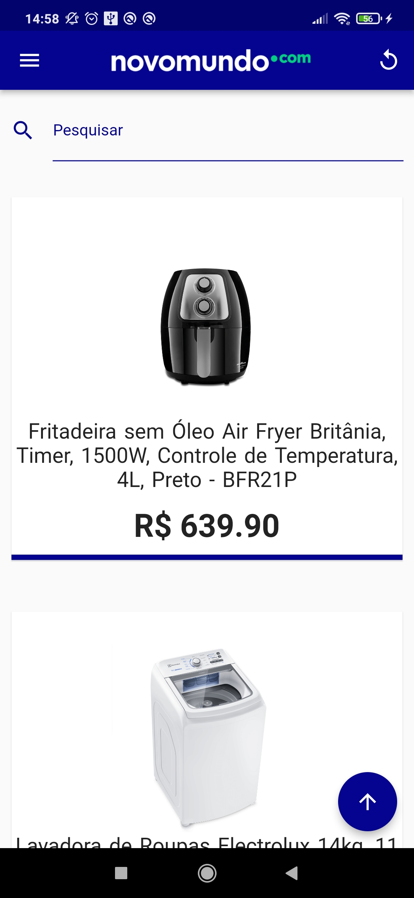

<h1 align="center">desafio_flutter</h1> 

Desafio em flutter para aplicação dos conhecimento adquiridos.

<h1 align="center">App</h1> 

  </img>
  </img>
  </img>
  </img>
  </img>
  </img>
  </img>

<h1 align="center">Funcionamento</h1>

  </img>
  </img>
  </img>

### Instrução para implementar o App recomendado pelo Flutter

#### Api utilizadas

Este projeto é um ponto de partida para um aplicativo Flutter.

Alguns recursos para você começar, se este for seu primeiro projeto Flutter:

- [Laboratório: Escreva seu primeiro aplicativo Flutter] (https://flutter.dev/docs/get-started/codelab)
- [Livro de receitas: amostras úteis de flutuação] (https://flutter.dev/docs/cookbook)

Para obter ajuda para começar a usar o Flutter, consulte nosso
[documentação online] (https://flutter.dev/docs), que oferece tutoriais,
amostras, orientação sobre desenvolvimento móvel e uma referência completa de API.

